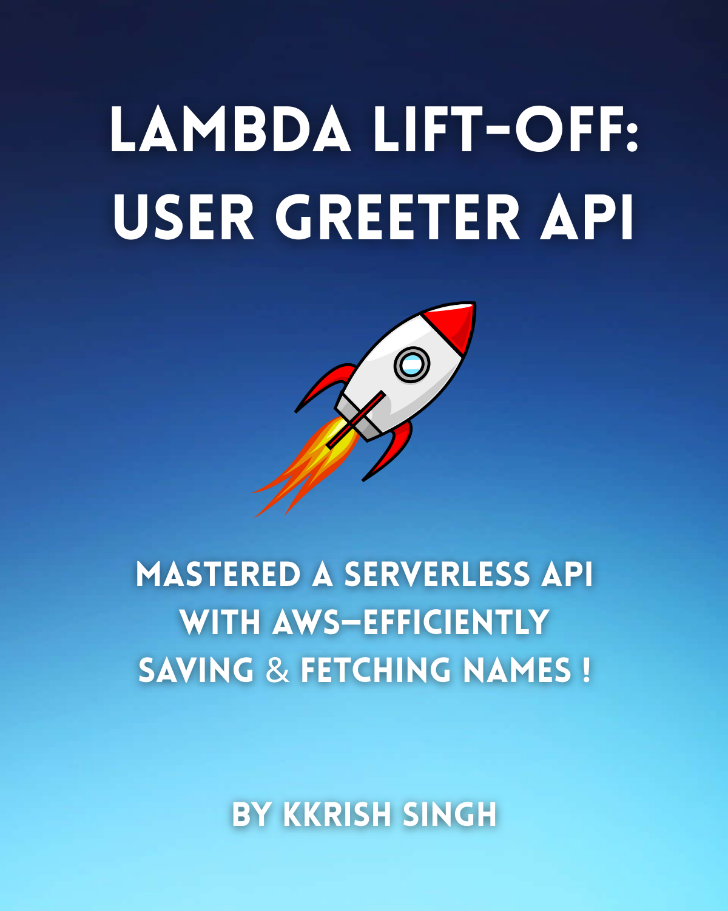

# 🚀 Lambda Lift-Off: User Greeter API

  

> Mastered a serverless API with AWS — efficiently saving & fetching names!
!

---

## 🔧 Tech Stack

- **AWS Lambda** – For serverless backend functions  
- **API Gateway** – To expose Lambda functions via RESTful APIs  
- **Amazon DynamoDB** – For NoSQL data storage  
- **Python** – As the programming language for Lambda functions
